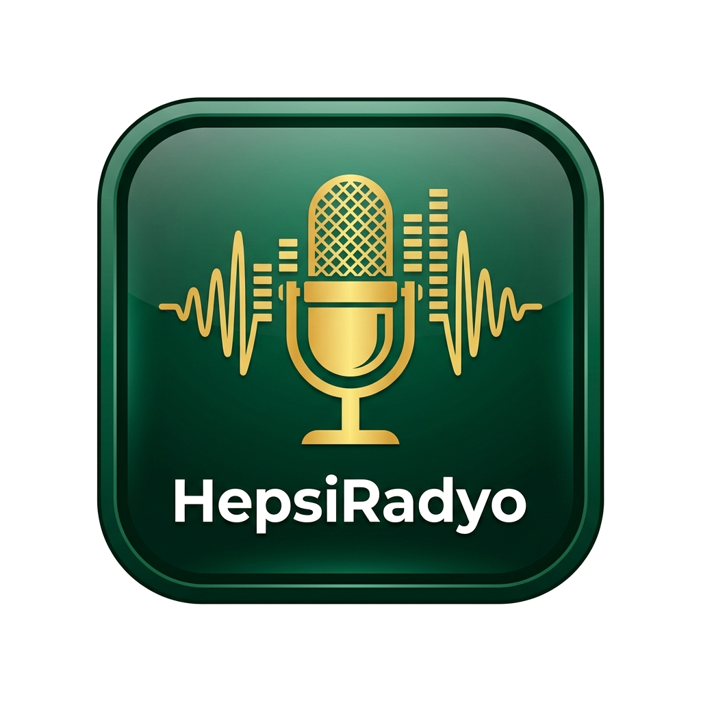

# 📻 HepsiRadyo — Kesintisiz Canlı Radyo Dinleme Uygulaması



**HepsiRadyo**, Türkiye ve dünya genelinden 600'ü aşkın canlı radyo istasyonunu yüksek kalitede, kesintisiz ve şık bir arayüzle sunan modern bir Flutter mobil & web uygulamasıdır.

---

## ✨ Öne Çıkan Özellikler

- 🎶 **600+ Canlı Radyo Kanalı:** Pop, Arabesk, Türkü, Haber, Spor, Dini ve Yabancı kategorilerde geniş yayın yelpazesi.
- ⚡ **Kesintisiz HTTPS / HLS Akış Altyapısı:** Karnaval (Metro FM, Virgin Radio, Süper FM vb.) ve StreamTheWorld sunucuları için resmi dinamik yük dengeleyici yönlendirmeleri ile donma yapmayan akış.
- 🎵 **Canlı Şarkı & Metin Bilgisi (ICY Metadata):** Yayınlanan anlık şarkı isimlerini otomatik algılama ve Türkçe karakter bozulmalarını (Windows-1254 Mojibake) anında onarma.
- 📜 **Çerçevesiz ve Kesintisiz Kayar Yazı (Marquee Text):** Uzun ve kısa şarkı isimlerini ekranın merkezinde yumuşak kayar yazı animasyonu ile gösterme.
- 🏆 **Top 50 Sıralaması & Altın/Gümüş/Bronz Kartlar:** Günlük, Haftalık ve Tüm Zamanlar sıralama filtreleri ile kullanıcı etkileşimine göre dinamik liderlik tablosu.
- 🎨 **Lüks Yeşil & Şarap Kırmızısı Cam Efektli (Glassmorphism) Arayüz:** Modern tipografi, dinamik arka plan renk geçişleri ve akıcı mikro-animasyonlar.
- ⬆️ **Tek Tıklama ile En Üste Kaydırma (Scroll-to-top):** Herhangi bir sayfada aşağıdayken alt menüdeki aktif sekme butonuna basıldığında sayfayı anında yumuşakça en üste kaydırma.
- 📱 **Scroll-Aware Küçülen Mini Player:** Sayfa aşağı veya yukarı kaydırılırken mini oyuncu ve menünün küçülerek ekranda yer açması.
- 🚀 **Animasyonlu Splash Ekranı:** Şeffaf uygulama logosu, parlama ışığı ve canlı yükleme çubuğu ile premium açılış deneyimi.
- ☁️ **Supabase Realtime & Hive Offline Önbellek:** Veritabanındaki canlı güncellemeleri anında ekrana yansıtma ve internetsiz modda hızlı açılış.

---

## 🛠️ Teknolojik Mimari

- **Framework:** Flutter 3.x (Web, Android & iOS Uyumlu)
- **State Management:** Flutter Riverpod (`flutter_riverpod`)
- **Ses Motoru:** `just_audio` & `audio_service` (Arka planda ve kilit ekranında çalma desteği)
- **Veritabanı & Backend:** Supabase Postgres (`supabase_flutter`) & Supabase Deno Edge Functions
- **Yerel Depolama:** Hive (`hive_flutter`)
- **Animasyonlar:** `flutter_animate`
- **Yayın Veri Scriptleri:** Python (Radio-Browser API entegrasyonu, `url_resolved` çözümleyici ve akış doğrulayıcı)

---

## 📁 Proje Dizin Yapısı

```text
lib/
├── core/
│   ├── audio/          # Ses servisi, audio handler ve player state notifier
│   ├── network/        # Supabase istemcisi & CORS-safe image helper
│   ├── router/         # Navigasyon kabuğu & bottom navbar animasyonu
│   ├── storage/        # Hive çevrimdışı radyo ve istatistik önbelleği
│   └── theme/          # Renk paleti, gradyanlar ve tasarım tokenları
├── features/
│   ├── categories/     # Kategori listesi & detay ekranları
│   ├── favorites/      # Favori radyolarım ekranı
│   ├── home/           # Ana sayfa, slider bannerlar ve radyo kartları
│   ├── player/         # Tam ekran oyuncu & uyku zamanlayıcı diyaloğu
│   ├── splash/         # Animasyonlu yükleme (splash) açılış ekranı
│   ├── top50/          # En çok dinlenen Top 50 liderlik tablosu
│   └── settings/       # Tema ve uygulama tercihleri
└── shared/
    ├── models/         # RadioModel, CategoryModel, BannerModel
    └── widgets/        # MarqueeText, RadioCard, GlassContainer, DynamicIsland
```

---

## 🚀 Kurulum ve Çalıştırma

### 1. Depoyu Klonlayın
```bash
git clone https://github.com/mxmatheus/Hepsi-Radyo.git
cd Hepsi-Radyo
```

### 2. Bağımlılıkları Yükleyin
```bash
flutter pub get
```

### 3. Uygulamayı Yerelde Çalıştırın
```bash
# Web ortamında çalıştırmak için:
flutter run -d chrome

# Mobil emülatörde çalıştırmak için:
flutter run
```

---

## ⚙️ Python Veri Güncelleme Scriptleri

Radyo listesini güncellemek, kapalı linkleri test etmek ve Supabase veritabanına aktarmak için hazır scriptler:

```bash
# Tüm radyoların canlı yayın linklerini test eder, kırık adresleri yenileriyle değiştirir:
python scripts/test_and_clean_all_663.py

# Çözümlenmiş yayın linklerini Supabase veritabanınıza yükler:
python scripts/sync_radio_browser.py --url YOUR_SUPABASE_URL --key YOUR_SERVICE_ROLE_KEY
```

---

## 📝 Lisans

Bu proje MIT Lisansı altında lisanslanmıştır. Serbestçe geliştirilebilir ve dağıtılabilir.
